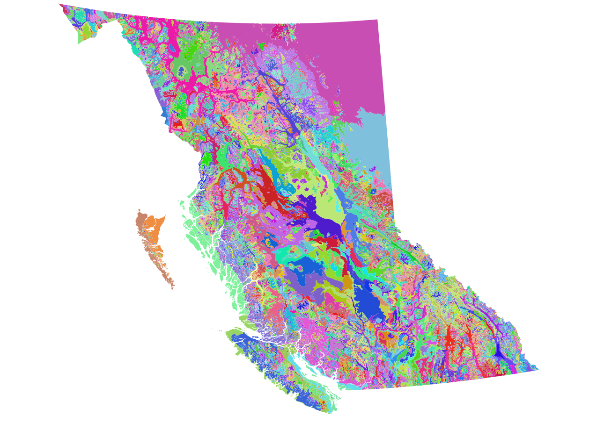

# BEC Explorer

Help us turn this, into something people can use to explore their environent 

## About 
The BEC Climate Explorer is a project to build an interactive data viewer for the Biogeoclimate Ecosystem Classification (BEC) zones in North America. The BEC Climate zones "provides immense value as a baseline ecological condition to assess the affects of climate change" but currently there are few/no resources available for researchers working with the BEC zones (e.g. ecologists, foresters, etc) to explore this massive dataset without using desktop GIS tools. The idea is to start building a web based interface for researchers to explore the data.

## Contributing
see [Contributing Guidelines](CONTRIBUTING.md)

## Run web app
see [Setup](SETUP.md)

## Roadmap
see [Roadmap](ROADMAP.md)

## Code of Conduct
see [Code of conduct](CODEOFCONDUCT.md)

## Personas & Pathways
see [Personas and pathways](PERSONAS.md)

