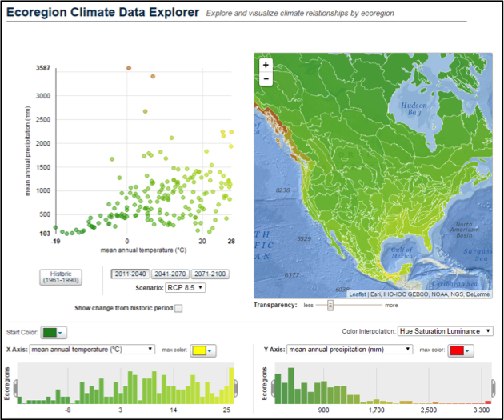
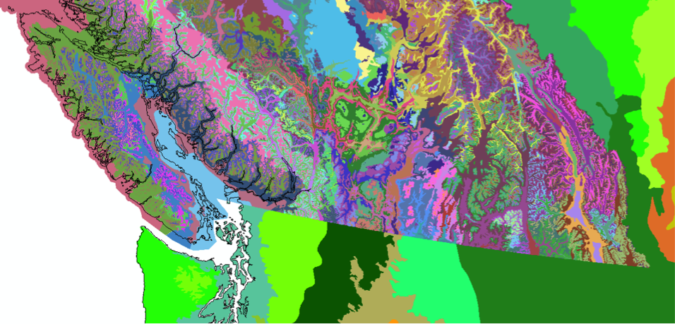
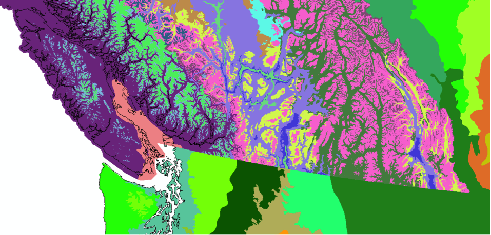
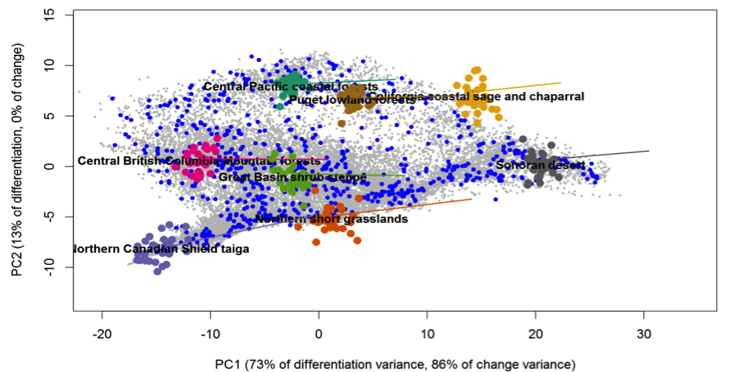
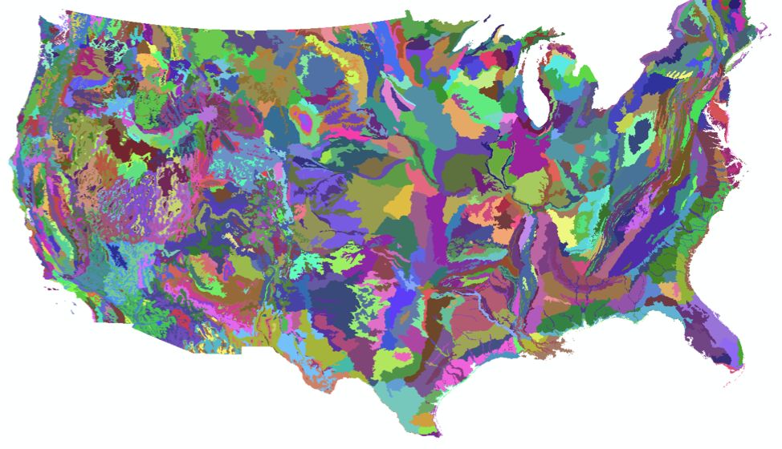
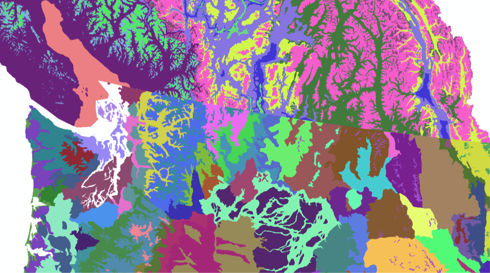
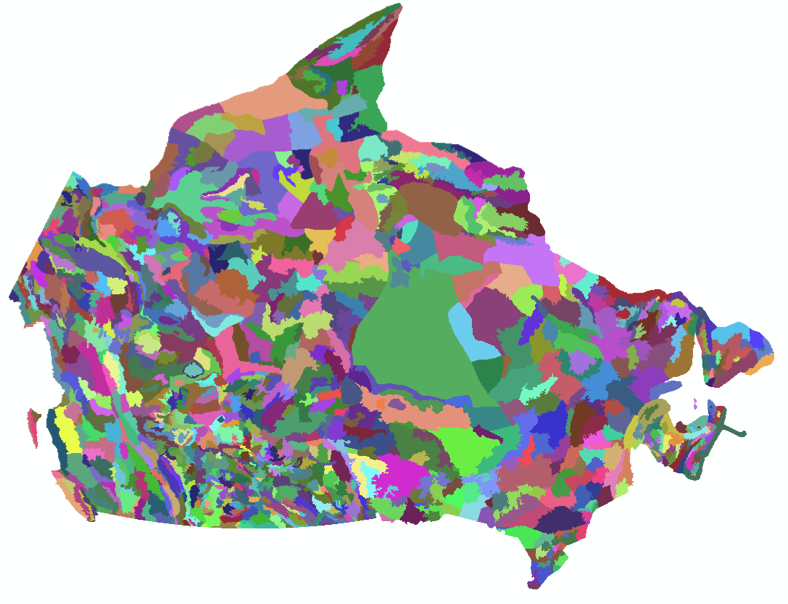
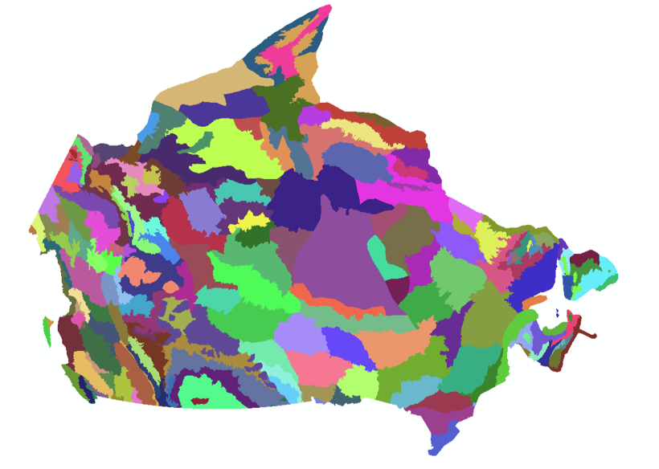
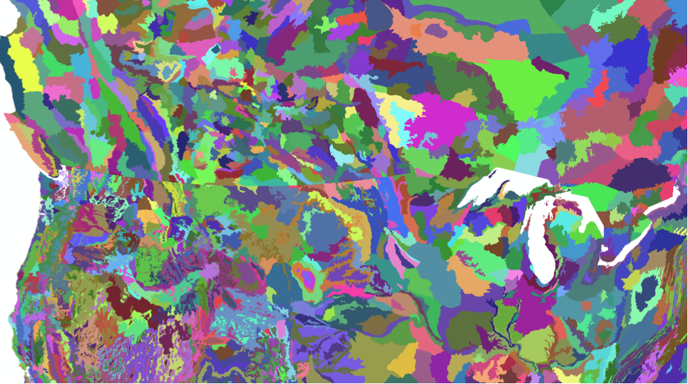

# Roadmap

## Project Scoping

This document outlines the evolving goals of the BEC Explorer. See [Concept](CONCEPT.md) for requirements.

## Stage 1: 'Recreate the Ecoregion Climate Data Explorer for BEC'

### Things to keep: 
* Hover-over identification of both geographic and climatic space
* Subsetting of the range of climate variables

###Things to change: 
* Just do for the historic climates only. Future climates can be illustrated with trajectories
* Default to log-scale for precipitation, with option to turn off
* More detail at higher zoom levels (less generalized maps)

### Data:
* ~200 Biogeoclimatic Variants. [14765 polygons] 500Mb shapefile (!), nested within 14 zones
* Also generalized to 1:20k/250k/2M, so perhaps could manage this with zoom levels
* Spatial detail of BEC variants (on background of ecoregions)
* Spatial detail of 14 BEC zones (on background of ecoregions)


## Stage 2: Add Functionality for Focal Units
Clicking on a polygon or scatterpoint selects a “focal” unit. 

1. Time series. Add a 1901-2012 time series for Focal unit (one time series each for the primary and secondary variables). 
	* Time series would be located above the variable histograms
	* Individual years could be included on the scatterplot to show range of interannual variability
	* Hover-over could show the running mean time series for a secondary unit
2.	Climate change trajectory
	* 1960s, 1990s, 2020s, 2050s, 2080s normals for ensemble mean
		* Linked by a line
		* Show for RCP2.6, RCP4.5, RCP8.5
	* Could be scaled up to include ensemble members (15 GCMs)
3.	Narrative text
	* Description of the focal unit
		* 	E.g. https://www.for.gov.bc.ca/rco/research/eco/bec_web/docs/CWHdm.htm
		ii.	E.g. Bunchgrass / Ponderosa Pine (BG/PP): “The Bunchgrass and Ponderosa Pine zones are limited to low-elevation areas in the rainshadow of the southern mountains where dry, hot growing-season climates prevail. Grasslands, and ponderosa pine or Douglas-fir forest, * the dominant upland vegetation. Wetlands are primarily marshes.”
		* 	https://www.for.gov.bc.ca/hfd/pubs/docs/Lmh/Lmh23-3.pdf 
		* 	E.g. https://www.for.gov.bc.ca/hfd/pubs/docs/bro/bro54.pdf
		* 	https://www.for.gov.bc.ca/hfd/pubs/Docs/Srs/Srs06.htm

## Stage 3: Analog Identification
* Hover over a focal unit’s projected condition to show the best current analog (color themed by similarity)
* Analog similarity could be hard-coded as seasonal sigma similarity, or calculated from the 2D sigma similarity of the primary and secondary selected variables. 
* Need to go with a fairly fine-scale mapping unit (US level 4 ecoregions, Canadian ecodistricts). 


### Data:

* US ecoregion level IV: (7242 polygons)

* Compared to BGC zones of british columbia

* Ecodistricts (top) versus Ecoregions (bottom)

* Ecodistricts (1025 polygons)


* Canadian Ecodistricts vs. US level 4 ecoregions. 

<!--## Short/Mid Term

* Develop **map based visualization**, data explorer of the BEC data:
	* Figure out workflow to go from massive shapefile to an interactive map layer.
	* Build in map based queries (could be a cartodb thing?) - also link to interactive graphs for filtering
	* png/pdf export of graph for static use
* Develop **complementary graphs** for sorting and filtering map data:
	* Interactive graphs to work with variables of dataset
	* png/pdf export of graph for non-web based use
* Develop **"BEC Stories"** to highlight features of dataset:
	* e.g. Vancouver climate analogs? 

## Long Term

* Create workflow for shp to web geo 
* png/pdf export of graph for static use-->